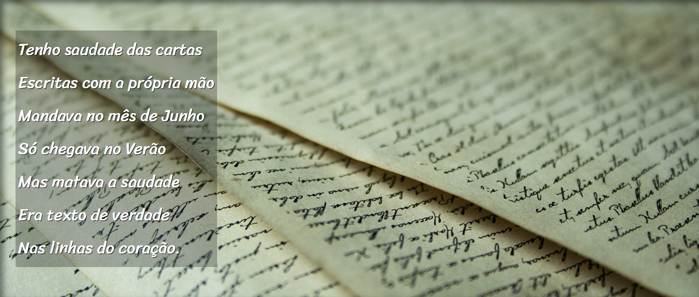

# Projeto Cordel

Este foi mais um projeto feito no CursoemVídeo com o professor Gustavo Guanabara e contém o poema de Milton Duarte, esse poema é de domínio público e foi liberado para os alunos poderem usar seu poema e ajudar na divulgação. No link do site oficial dentro do projeto tem os agradecimentos do próprio autor do poema.

## Demonstração

## Link do projeto

Este é o link do projeto <a href= "https://anajulialeite.github.io/projeto-cordel/">Cordel</a>

## License

